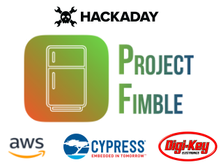
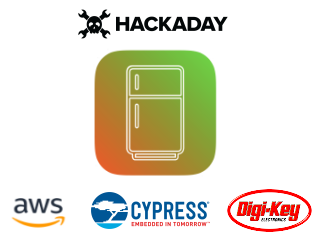

# Project Fimble

Hackaday Project:

- https://hackaday.io/project/171810-fimble

## Cloning this repo

Clone the repo including all the submodules

	$ git clone --recurse-submodules https://github.com/zst123/Project_Fimble

## PSoC 6 Firmware

Under the folder [*amazon-freertos*](./amazon-freertos).

To import into ModusToolbox IDE:

1. Ensure your AWS credentials are copied into the project
  - `demos/include/aws_clientcredential.h`
  - `demos/include/aws_clientcredential_keys.h`

1. Import the demo project: *File > Import > General > Existing Projects into Workspace*

1. Choose the demo project for CY8CKIT_062_WIFI_BT: **
  - `Project_Fimble/amazon-freertos/projects/cypress/CY8CKIT_062_WIFI_BT/mtb/aws_demos`

## Flutter App (Android/Web)

Under the folder [*flutter_fimble*](./flutter_fimble).

*See README.md in the folder for screenshots*

## AWS Lambda Code

Under the folder [*aws-lambda*](./aws-lambda).

> NodeJS 12.x Runtime

1. API-Gateway.js
  - Retrieves all the records in the DynamoDB database and displays it on a HTTP page.

2. MQTT-Handler.js
  - Handle MQTT messages from the IoT device and insert it into the DynamoDB database

> https://6o55ed7zce.execute-api.ap-southeast-1.amazonaws.com/retrieve

## emWin Converter

Under the folder [*emWin-Converter*](./emWin-Converter).

I created a Python script to generate the emWin bitmap format, and I created these splash screens for my project

|  |  |
| --- | --- |
|  |  |

## Enclosure

Under the folder [*enclosure*](./enclosure).

This is my design of a paper craft enclosure for the Cypress PSoC® 6 WiFi-BT Pioneer Kit (CY8CKIT-062-WiFi-BT).

 | 
--- | ---
 | 
 | 
