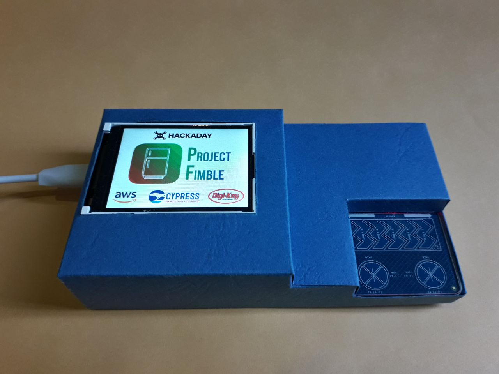
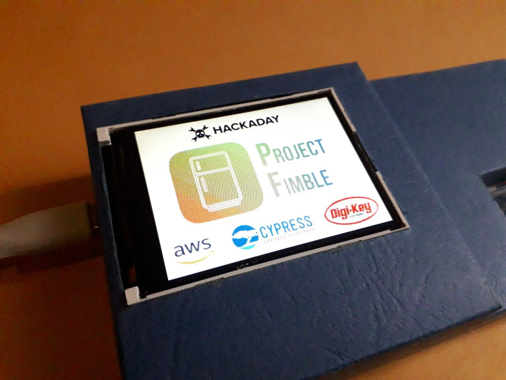
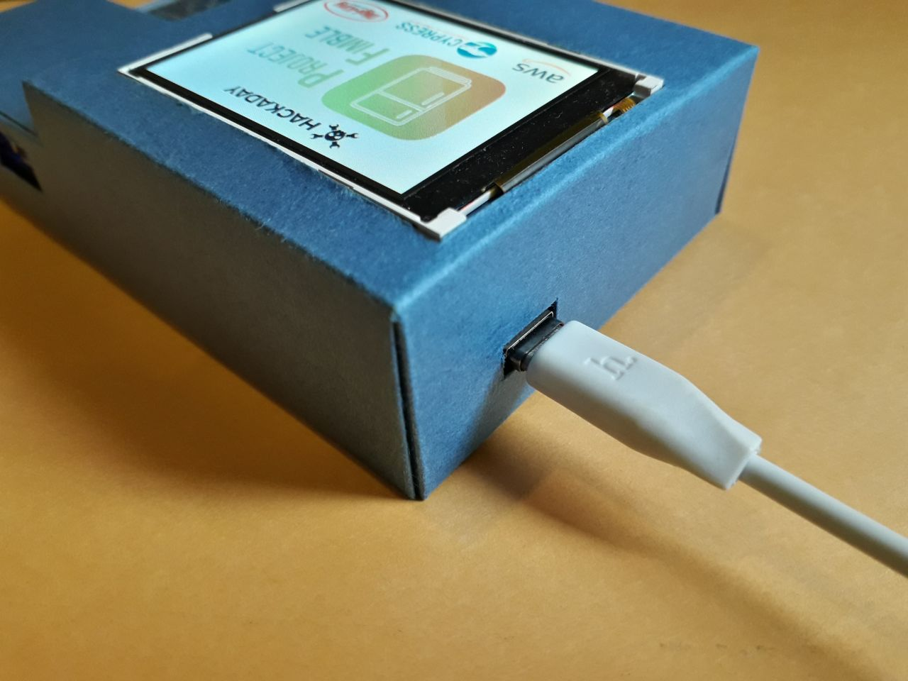
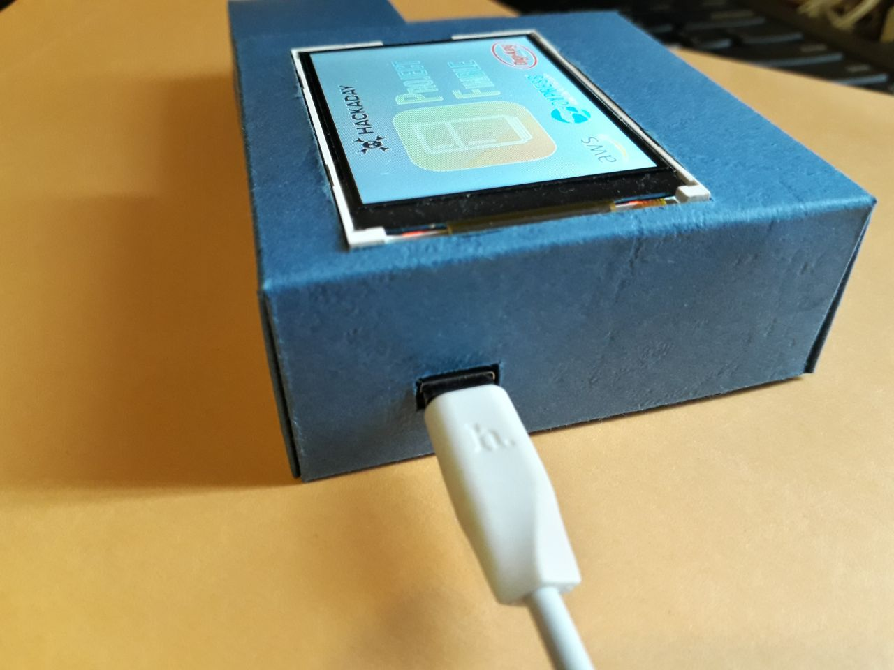
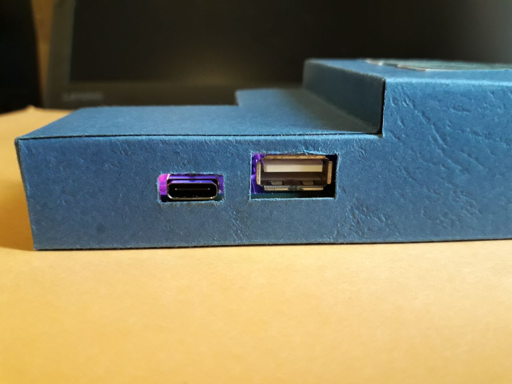
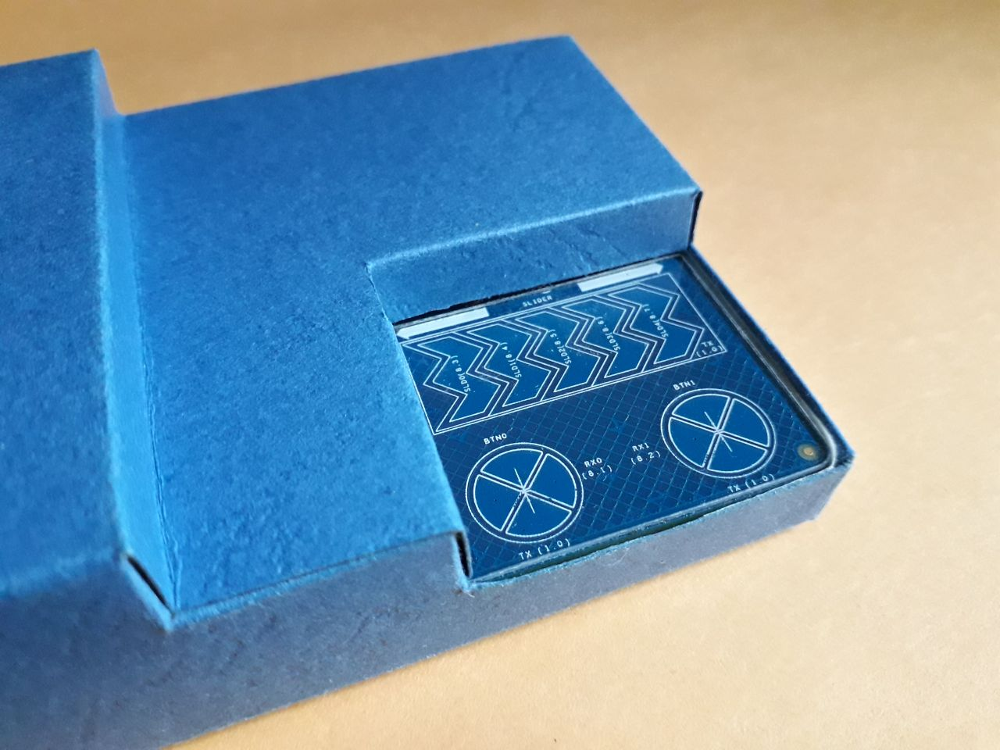

## Paper Craft Enclosure

This is my design of a paper craft enclosure for the Cypress PSoC® 6 WiFi-BT Pioneer Kit (CY8CKIT-062-WiFi-BT).

### Design

I made the design in PowerPoint. It should be printed on a thick paper or card stock.

- [Paper Craft Enclosure.pdf](Paper%20Craft%20Enclosure.pdf)

- [Paper Craft Enclosure.pptx](Paper%20Craft%20Enclosure.pptx)

### Images

 | 
--- | ---
 | 
 | 

### Inspiration

I was inspired by these 3D printed cases

- https://hackaday.io/project/171935-nanodrone-for-iot-environmental-data-collection/log/178724-psoc6-wifi-bt-pioneer-kit-3d-case-design
- https://www.element14.com/community/community/design-challenges/connected-cloud-challenge-with-cypress-and-aws-iot/blog/2020/05/27/super-smart-home-13-psoc6-protection-case
