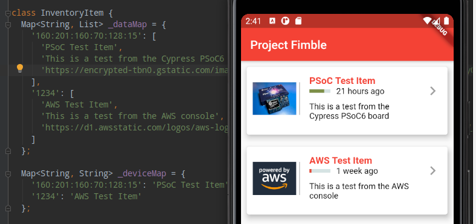
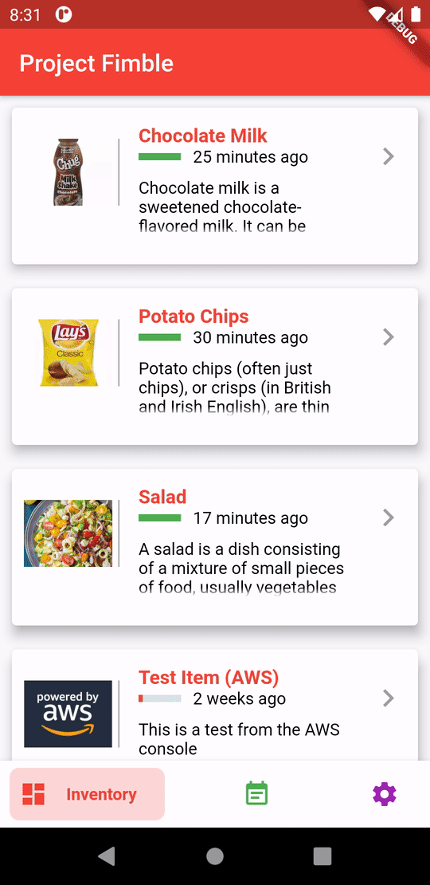
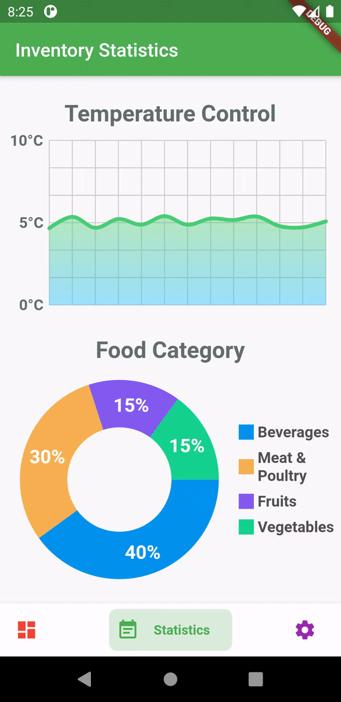
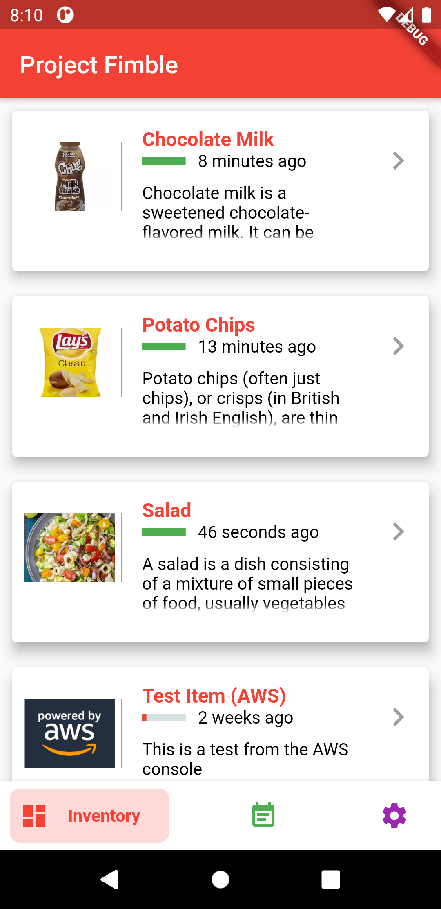
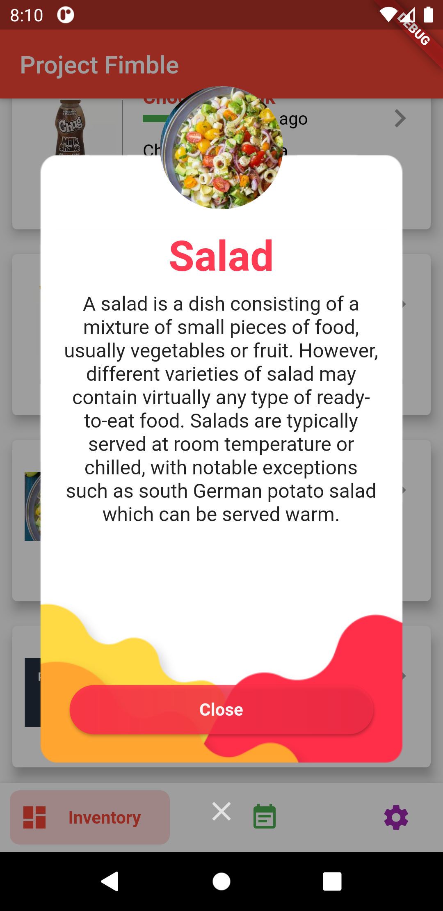
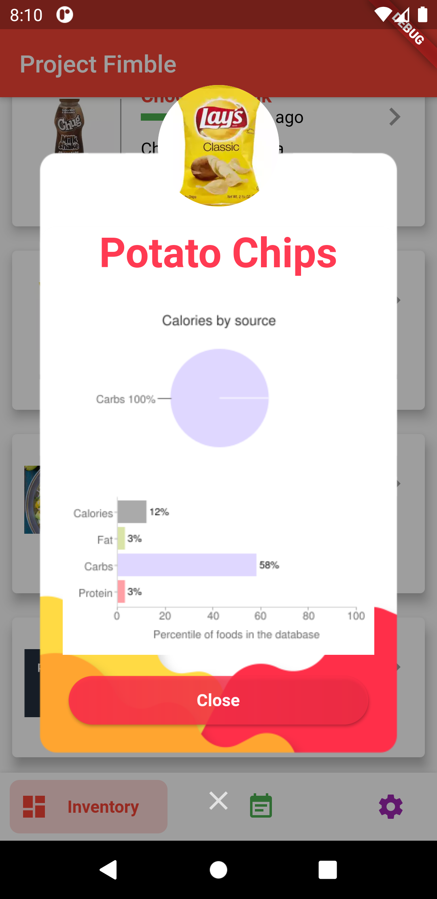
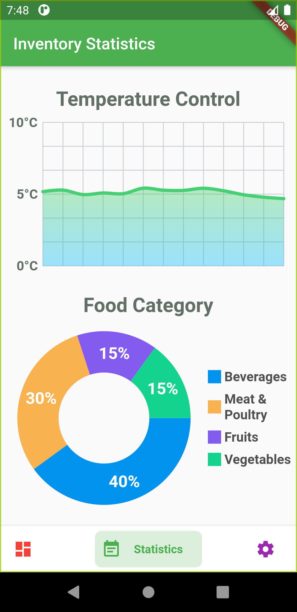
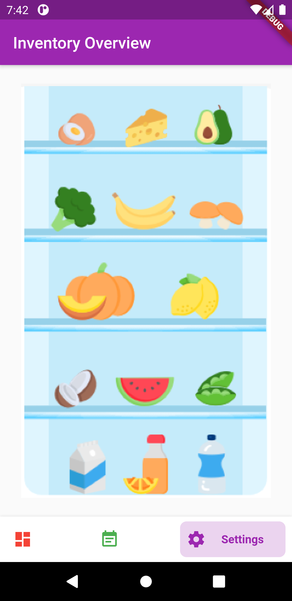

# flutter_fimble

This is a Flutter app for Project Fimble. It is a concept implementation of smart inventory tracking such as a smart fridge.

# Usage

Android App

- Import and build the project with Android Studio

Web App

	$ flutter build web
	$ flutter run -d web-server --release

# Screenshots

Here are some GIFs.

| Preview of each page | Food Nutritional Details | Inventory Statistics |
| --- | --- | --- |
|  |  |  | 

### Inventory Page

The first page will show all the items currently inside the inventory (eg. items inside your smart fridge). When the user clicks on an item, there will be a description of the item and also nutritional values of the food item.

 |  |  |
| --- | --- |
|  | 

### Statistics Page

This page will display the settings of temperature control of the storage area. It is useful especially for sensitive food items which need to be stored at a certain temperature. A breakdown of the category of the items can also be derived via analytics from all the data gathered through this smart inventory system.

|  |  |
| --- | --- |
|  |  |

### Overview Page

The overview page is useful for large inventories especially in warehouses. By providing visual icon representation of the storage area, the workers in a warehouse can quickly navigate and find the item they are looking for.

|  |  |
| --- | --- |
|  |  |
